# Phase 5: Requirements Validation

**Phase Objective**: Validate requirements through 5 critical dimensions to ensure they are ready for implementation.
**Time Allocation**: 15% of total effort
**Your Role**: Professional Requirements Analyst

---

## Quick Reference

| Validation Dimension | Focus | Key Question |
|---------------------|-------|--------------|
| **Authenticity** | Real need | Is this a genuine user/business need? |
| **Completeness** | Coverage | Are all aspects fully specified? |
| **Consistency** | Coherence | Are requirements conflict-free? |
| **Feasibility** | Achievability | Is it technically and economically viable? |
| **Verifiability** | Testability | Can we objectively verify it's met? |

---

## Output

**File**: `.kiro/specs/[feature-name]/05-validation.md`
**Template**: See `template-validation.md`

---

## The 5 Validation Dimensions (CORE FRAMEWORK)

```mermaid
graph TB
    subgraph ValidationFramework["Requirements Validation Framework"]
        direction TB
        V1[/"🎯 Authenticity<br/>真实性"/]
        V2[/"📋 Completeness<br/>完整性"/]
        V3[/"🔗 Consistency<br/>一致性"/]
        V4[/"⚖️ Feasibility<br/>可行性"/]
        V5[/"✅ Verifiability<br/>可验证性"/]
    end

    REQ[Requirements] --> V1
    V1 --> V2
    V2 --> V3
    V3 --> V4
    V4 --> V5
    V5 --> VALID[Validated Requirements]

    style V1 fill:#e1f5fe,stroke:#01579b
    style V2 fill:#e1f5fe,stroke:#01579b
    style V3 fill:#e1f5fe,stroke:#01579b
    style V4 fill:#fff3e0,stroke:#e65100
    style V5 fill:#e8f5e9,stroke:#1b5e20
```



---

## MANDATORY: Multi-Role Validation

**CRITICAL**: Load `helper-multi-role-validation.md` for multi-role validation perspectives.

Requirements MUST be validated from 5 role perspectives:
- **Product Manager (PM)**: Business value, user need, strategic alignment
- **Requirements Analyst (RA)**: Completeness, clarity, traceability
- **Software Architect (SA)**: Technical feasibility, architecture impact, NFRs
- **Software Engineer (SE)**: Implementation clarity, effort estimation, error handling
- **Test Engineer (TE)**: Testability, acceptance criteria, test coverage

---

## Pre-Check (GATE CHECK)

**MUST pass this check before starting**:

- [ ] **Phase 4 completed?** Verify `04-clarification.md` exists with resolved ambiguities
- [ ] **Requirements documented?** All requirements in `03-analysis.md` are clarified
- [ ] **Stakeholders available?** Reviewers from different roles identified

**If ANY check fails**: STOP. Return to Phase 4.

---

## Dimension 1: Authenticity Validation (真实性验证)

### Purpose

Verify that requirements represent **genuine user needs** and **real business problems**, not assumptions or "nice-to-haves".

### Validation Criteria

| Criterion | Question | Evidence Required |
|-----------|----------|-------------------|
| **User Origin** | Did this come from actual users? | User interviews, feedback logs |
| **Problem Evidence** | Is there proof the problem exists? | Support tickets, user complaints, analytics |
| **Business Alignment** | Does it support business goals? | Business case, strategic plan link |
| **Stakeholder Confirmation** | Have stakeholders validated this need? | Sign-off, meeting minutes |
| **Usage Frequency** | How often will this be used? | Usage projections, market data |

### Authenticity Checklist

```markdown
## Authenticity Validation Checklist

### Source Verification
- [ ] Requirement traced to specific user/stakeholder request
- [ ] Original request documented (interview, ticket, email)
- [ ] Not based solely on assumptions or competitor features

### Problem Validation
- [ ] Problem statement clearly articulated
- [ ] Evidence of problem exists (metrics, complaints, observations)
- [ ] Impact of NOT solving this problem quantified

### Stakeholder Validation
- [ ] Business sponsor confirmed the need
- [ ] End users confirmed this solves their problem
- [ ] No stakeholder objections recorded

### Business Value
- [ ] Clear business benefit articulated
- [ ] ROI or value proposition defined
- [ ] Aligned with product strategy/roadmap
```

### Red Flags (Authenticity Issues)

| Red Flag | Description | Action |
|----------|-------------|--------|
| 🚩 "Users might want..." | Assumption without evidence | Conduct user research |
| 🚩 "Competitor has it" | Feature copying without validation | Validate with YOUR users |
| 🚩 No stakeholder source | Origin unclear | Trace back to source |
| 🚩 "Future-proofing" | Speculative requirement | Defer or validate need |

---

## Dimension 2: Completeness Validation (完整性验证)

### Purpose

Ensure requirements are **fully specified** with no missing information, gaps, or TBDs.

### Completeness Model


### Completeness Checklist

```markdown
## Completeness Validation Checklist

### Functional Coverage
- [ ] All user roles/personas covered
- [ ] All CRUD operations specified (if applicable)
- [ ] All business rules documented
- [ ] All decision points have defined outcomes

### Data Coverage
- [ ] All data entities defined
- [ ] All attributes specified with types
- [ ] All relationships documented
- [ ] Data validation rules complete
- [ ] Data lifecycle (create, update, archive, delete) defined

### Flow Coverage
- [ ] Main success scenarios documented
- [ ] Alternative flows identified
- [ ] Entry and exit points clear
- [ ] Handoffs between actors/systems defined

### State Coverage
- [ ] All possible states identified
- [ ] State transitions defined
- [ ] Transition triggers specified
- [ ] Invalid state transitions documented

### Error Coverage
- [ ] Error conditions identified
- [ ] Error messages specified
- [ ] Recovery procedures defined
- [ ] Error escalation paths documented

### Non-Functional Coverage
- [ ] Performance requirements quantified
- [ ] Security requirements specified
- [ ] Scalability requirements defined
- [ ] Availability requirements documented
- [ ] Compliance requirements listed
```

### Completeness Metrics

| Category | Total Items | Specified | Complete (%) | Target |
|----------|-------------|-----------|--------------|--------|
| Functional | [N] | [N] | [%] | ≥95% |
| Data | [N] | [N] | [%] | ≥95% |
| Flows | [N] | [N] | [%] | ≥90% |
| States | [N] | [N] | [%] | ≥90% |
| Errors | [N] | [N] | [%] | ≥85% |
| NFRs | [N] | [N] | [%] | ≥90% |

---

## Dimension 3: Consistency Validation (一致性验证)

### Purpose

Ensure requirements are **internally coherent** with no conflicts, contradictions, or ambiguous overlaps.

### Consistency Types

| Type | Description | Example |
|------|-------------|---------|
| **Internal** | No conflicts within same requirement | Field is both "required" and "optional" |
| **Inter-requirement** | No conflicts between requirements | REQ-1 says A, REQ-2 says NOT A |
| **Terminology** | Same term means same thing everywhere | "User" vs "Customer" vs "Client" |
| **Data** | Data definitions consistent | Field length differs in different places |
| **Temporal** | No timeline conflicts | Deadline A before deadline B, but B is prerequisite |

### Consistency Checklist

```markdown
## Consistency Validation Checklist

### Terminology Consistency
- [ ] Glossary defined and maintained
- [ ] Same concepts use same terms
- [ ] No synonyms used interchangeably
- [ ] Acronyms expanded on first use

### Data Consistency
- [ ] Field names consistent across requirements
- [ ] Data types consistent for same fields
- [ ] Validation rules consistent
- [ ] Format specifications consistent (dates, numbers, etc.)

### Logic Consistency
- [ ] No contradictory business rules
- [ ] No conflicting conditions
- [ ] Priority order logical (no circular dependencies)
- [ ] Precedence rules clear when conflicts possible

### Reference Consistency
- [ ] Cross-references valid and up-to-date
- [ ] No orphan requirements (unreferenced)
- [ ] No broken links to design/test documents
- [ ] Version references consistent
```

### Conflict Detection Matrix

| Req A | Req B | Conflict Type | Resolution |
|-------|-------|---------------|------------|
| REQ-001 | REQ-005 | [Type] | [How resolved] |
| REQ-003 | REQ-007 | [Type] | [How resolved] |

---

## Dimension 4: Feasibility Validation (可行性验证)

### Purpose

Validate that requirements are **achievable** from technical, economic, operational, and schedule perspectives.

### Feasibility Dimensions

```mermaid
graph TB
    subgraph FeasibilityTypes["Comprehensive Feasibility Assessment"]
        direction TB
        TF["🔧 Technical Feasibility<br/>技术可行性"]
        EF["💰 Economic Feasibility<br/>经济可行性"]
        OF["⚙️ Operational Feasibility<br/>运营可行性"]
        SF["📅 Schedule Feasibility<br/>时间可行性"]
        LF["⚖️ Legal/Compliance<br/>合规可行性"]
    end

    style TF fill:#e1f5fe,stroke:#01579b
    style EF fill:#e8f5e9,stroke:#1b5e20
    style OF fill:#fff3e0,stroke:#e65100
    style SF fill:#f3e5f5,stroke:#4a148c
    style LF fill:#ffebee,stroke:#b71c1c
```



### 4.1 Technical Feasibility (技术可行性)

| Assessment Area | Questions | Rating |
|-----------------|-----------|--------|
| **Technology Maturity** | Is the required technology proven? | High/Medium/Low |
| **Team Capability** | Does team have required skills? | High/Medium/Low |
| **Architecture Fit** | Compatible with existing architecture? | High/Medium/Low |
| **Integration Complexity** | Can we integrate with required systems? | High/Medium/Low |
| **Performance Achievability** | Can we meet performance requirements? | High/Medium/Low |
| **Security Implementation** | Can we implement security requirements? | High/Medium/Low |

### 4.2 Economic Feasibility (经济可行性)

```markdown
## Economic Feasibility Analysis

### Development Costs
| Cost Category | Estimate | Confidence |
|---------------|----------|------------|
| Development effort | [Person-months] | High/Medium/Low |
| Infrastructure | [Cost] | High/Medium/Low |
| Third-party licenses | [Cost] | High/Medium/Low |
| External services | [Cost] | High/Medium/Low |
| **Total Development** | **[Sum]** | |

### Operational Costs (Annual)
| Cost Category | Estimate | Confidence |
|---------------|----------|------------|
| Hosting/Infrastructure | [Cost] | High/Medium/Low |
| Maintenance | [Cost] | High/Medium/Low |
| Support | [Cost] | High/Medium/Low |
| Third-party fees | [Cost] | High/Medium/Low |
| **Total Operational** | **[Sum]** | |

### Benefit Analysis
| Benefit Category | Estimate | Timeframe |
|------------------|----------|-----------|
| Revenue increase | [Amount] | [Period] |
| Cost reduction | [Amount] | [Period] |
| Efficiency gain | [Amount] | [Period] |
| Risk mitigation | [Value] | [Period] |
| **Total Benefit** | **[Sum]** | |

### ROI Calculation
- **Total Investment**: [Development + Year 1 Operational]
- **Annual Benefit**: [Total Benefit]
- **Payback Period**: [Months/Years]
- **3-Year ROI**: [Percentage]

### Economic Decision
- [ ] ✅ Economically viable (ROI meets threshold)
- [ ] ⚠️ Marginal (requires further analysis)
- [ ] ❌ Not viable (costs exceed benefits)
```

### 4.3 Operational Feasibility (运营可行性)

| Assessment Area | Questions | Status |
|-----------------|-----------|--------|
| **Process Impact** | How will this change existing processes? | [Assessment] |
| **Training Required** | What training is needed? | [Hours/Cost] |
| **Change Management** | How disruptive is this change? | High/Medium/Low |
| **Support Capability** | Can support team handle this? | Yes/Needs Scaling |
| **Data Migration** | Is data migration required? | [Scope/Risk] |

### 4.4 Schedule Feasibility (时间可行性)

| Milestone | Required Date | Achievable Date | Gap | Risk |
|-----------|---------------|-----------------|-----|------|
| Design Complete | [Date] | [Date] | [Days] | High/Medium/Low |
| Development Complete | [Date] | [Date] | [Days] | High/Medium/Low |
| Testing Complete | [Date] | [Date] | [Days] | High/Medium/Low |
| Release | [Date] | [Date] | [Days] | High/Medium/Low |

### 4.5 Legal/Compliance Feasibility (合规可行性)

| Requirement | Regulation | Compliance Status | Gap |
|-------------|------------|-------------------|-----|
| Data Privacy | GDPR/CCPA | Compliant/Gap | [Description] |
| Accessibility | WCAG 2.1 | Compliant/Gap | [Description] |
| Industry Specific | [Regulation] | Compliant/Gap | [Description] |

### Feasibility Summary

| Dimension | Rating | Risk Level | Blocking Issues |
|-----------|--------|------------|-----------------|
| Technical | High/Medium/Low | High/Medium/Low | [Count] |
| Economic | Viable/Marginal/Not Viable | High/Medium/Low | [Count] |
| Operational | High/Medium/Low | High/Medium/Low | [Count] |
| Schedule | Achievable/At Risk/Not Achievable | High/Medium/Low | [Count] |
| Legal/Compliance | Compliant/Gaps/Non-compliant | High/Medium/Low | [Count] |

---

## Dimension 5: Verifiability Validation (可验证性验证)

### Purpose

Ensure every requirement can be **objectively verified** through testing, measurement, or inspection.

### Verifiability Criteria

| Criterion | Description | Example |
|-----------|-------------|---------|
| **Measurable** | Has quantifiable target | "Response time < 2 seconds" |
| **Observable** | Can see/detect outcome | "Button changes to green" |
| **Testable** | Can create test case | Clear pass/fail criteria |
| **Demonstrable** | Can show to stakeholder | Working prototype possible |

### Verifiability Checklist

```markdown
## Verifiability Validation Checklist

### Quantification
- [ ] Performance requirements have numeric targets
- [ ] Capacity requirements have specific limits
- [ ] Quality requirements have measurable thresholds
- [ ] No vague terms like "fast", "user-friendly", "secure"

### Test Design
- [ ] Each requirement has at least one test case design
- [ ] Acceptance criteria in Given-When-Then format
- [ ] Edge cases identified with test scenarios
- [ ] Negative test cases designed

### Verification Method
- [ ] Verification method specified for each requirement
  - [ ] Test (automated/manual)
  - [ ] Inspection (code review, document review)
  - [ ] Analysis (calculation, simulation)
  - [ ] Demonstration (prototype, live demo)

### Acceptance Criteria
- [ ] Every requirement has acceptance criteria
- [ ] Criteria are specific and unambiguous
- [ ] Criteria are achievable (not impossible to meet)
- [ ] Criteria are independent (not relying on uncontrolled factors)
```

### GWT Acceptance Criteria Format

```gherkin
## Requirement: [REQ-ID] [Requirement Name]

### AC-1: [Scenario Name]
Given [precondition/context]
  And [additional precondition]
When [action/trigger]
Then [expected outcome]
  And [additional outcome with measurable criteria]

### AC-2: [Error Scenario]
Given [precondition]
When [error condition]
Then [error handling behavior]
  And [user notification with specific message]
```

### Verification Matrix

| Req ID | Verification Method | Test Cases | Acceptance Criteria | Status |
|--------|---------------------|------------|---------------------|--------|
| REQ-001 | Test | TC-001~003 | AC-001~003 | ✅ Verifiable |
| REQ-002 | Demonstration | Demo-001 | AC-004~005 | ✅ Verifiable |
| REQ-003 | Inspection | Review-001 | AC-006 | ⚠️ Needs refinement |

---

## Validation Process Flow


---

## Validation Report Template

```markdown
## Requirements Validation Report

**Project**: [Name]
**Date**: YYYY-MM-DD
**Validator**: [Name]

---

### Executive Summary

[2-3 sentences summarizing validation outcome]

**Overall Status**: ✅ Validated / ⚠️ Conditional / ❌ Failed

---

### Dimension Summary

| Dimension | Status | Score | Critical Issues |
|-----------|--------|-------|-----------------|
| Authenticity | ✅/⚠️/❌ | [%] | [Count] |
| Completeness | ✅/⚠️/❌ | [%] | [Count] |
| Consistency | ✅/⚠️/❌ | [%] | [Count] |
| Feasibility | ✅/⚠️/❌ | [Rating] | [Count] |
| Verifiability | ✅/⚠️/❌ | [%] | [Count] |

---

### Validation Radar Chart (五维验证雷达图)

\`\`\`mermaid
%%{init: {'theme': 'base', 'themeVariables': { 'primaryColor': '#e1f5fe'}}}%%
xychart-beta
    title "Requirements Validation Score"
    x-axis ["Authenticity", "Completeness", "Consistency", "Feasibility", "Verifiability"]
    y-axis "Score (%)" 0 --> 100
    bar [85, 92, 95, 78, 88]
    line [80, 80, 80, 80, 80]
\`\`\`

> **Note**: The line at 80% represents the minimum acceptable threshold. Dimensions below this line require attention.

#### Score Visualization

| Dimension | Score | Visual | Status |
|-----------|-------|--------|--------|
| **Authenticity** | [85]% | ████████░░ | ✅ Pass |
| **Completeness** | [92]% | █████████░ | ✅ Pass |
| **Consistency** | [95]% | █████████▌ | ✅ Pass |
| **Feasibility** | [78]% | ███████▌░░ | ⚠️ At Risk |
| **Verifiability** | [88]% | ████████▌░ | ✅ Pass |

**Legend**:
- ████████████ = 100% (Excellent)
- ████████░░ = 80% (Acceptable threshold)
- ██████░░░░ = 60% (Needs improvement)
- ████░░░░░░ = 40% (Critical)

#### Radar Analysis Summary

| Metric | Value |
|--------|-------|
| **Average Score** | [87.6]% |
| **Highest Dimension** | Consistency (95%) |
| **Lowest Dimension** | Feasibility (78%) |
| **Dimensions Above Threshold** | 4/5 |
| **Overall Balance** | Good / Moderate / Poor |

**Key Insight**: [1-2 sentences highlighting the most important observation from the radar chart. Example: "The validation shows strong specification quality (Consistency 95%, Completeness 92%) but Feasibility at 78% indicates schedule or resource constraints that need attention before proceeding."]

---

### Detailed Score Justification (MANDATORY)

**CRITICAL**: Every dimension score MUST include detailed justification explaining:
1. **Why this score**: Specific evidence that led to this score
2. **What was evaluated**: List of items checked
3. **Key findings**: Both positive and negative findings
4. **Score calculation**: How the percentage/rating was derived

---

#### 1. Authenticity Score: [X]% - [Status]

**Score Calculation**:
- Total requirements evaluated: [N]
- Requirements with verified origin: [N]
- Requirements with stakeholder confirmation: [N]
- **Formula**: (Verified + Confirmed) / (Total × 2) × 100 = [X]%

**Positive Findings** (Why score is this high):
| Req ID | Evidence Type | Source | Confidence |
|--------|---------------|--------|------------|
| REQ-001 | User interview | Interview #12, 2024-01-15 | High |
| REQ-002 | Support ticket | Ticket #456, 50+ similar reports | High |
| REQ-003 | Business case | Strategic Plan 2024, Section 3.2 | High |

**Negative Findings** (Why score is not higher):
| Req ID | Issue | Impact | Recommendation |
|--------|-------|--------|----------------|
| REQ-004 | No user evidence, assumption-based | May build unwanted feature | Conduct user validation |
| REQ-005 | Competitor feature copy | May not fit our users | Validate with target users |

**Authenticity Verdict**:
> [2-3 sentences explaining why this score is appropriate, referencing specific evidence above]

---

#### 2. Completeness Score: [X]% - [Status]

**Score Calculation**:

| Category | Total Items | Specified | Weight | Weighted Score |
|----------|-------------|-----------|--------|----------------|
| Functional | [N] | [N] | 30% | [%] |
| Data | [N] | [N] | 20% | [%] |
| Flows | [N] | [N] | 20% | [%] |
| States | [N] | [N] | 10% | [%] |
| Errors | [N] | [N] | 10% | [%] |
| NFRs | [N] | [N] | 10% | [%] |
| **Total** | | | 100% | **[X]%** |

**Positive Findings** (Complete areas):
- **Functional**: All [N] user stories have acceptance criteria
- **Data**: All [N] entities have complete attribute definitions
- **Flows**: Main success scenarios and [N] alternative flows documented

**Negative Findings** (Gaps identified):
| Gap ID | Category | Missing Item | Impact | Severity |
|--------|----------|--------------|--------|----------|
| GAP-001 | Error | Error handling for API timeout | Users see blank screen | Major |
| GAP-002 | State | State transition from "Pending" to "Cancelled" | Orphan records | Medium |
| GAP-003 | NFR | Specific latency target for search | Cannot verify performance | Medium |

**Completeness Verdict**:
> [2-3 sentences explaining the score, highlighting critical gaps and their impact]

---

#### 3. Consistency Score: [X]% - [Status]

**Score Calculation**:
- Total consistency checks performed: [N]
- Checks passed: [N]
- Conflicts detected: [N]
- Conflicts resolved: [N]
- **Formula**: (Checks Passed + Resolved) / Total Checks × 100 = [X]%

**Positive Findings** (Consistent areas):
- **Terminology**: [N] terms consistently used across [N] documents
- **Data types**: All [N] fields have consistent type definitions
- **Business rules**: [N] rules with no contradictions

**Negative Findings** (Inconsistencies found):
| Conflict ID | Type | Req A | Req B | Description | Resolution Status |
|-------------|------|-------|-------|-------------|-------------------|
| CON-001 | Logic | REQ-001 | REQ-005 | REQ-001 says "auto-approve < $100", REQ-005 says "all orders need approval" | Resolved: REQ-005 updated |
| CON-002 | Terminology | REQ-002 | REQ-008 | "Customer" vs "Client" used interchangeably | Resolved: Standardized to "Customer" |
| CON-003 | Data | REQ-003 | REQ-010 | Email max length: 100 vs 255 chars | Pending |

**Consistency Verdict**:
> [2-3 sentences explaining the score, highlighting any unresolved conflicts and their risk]

---

#### 4. Feasibility Score: [Rating] - [Status]

**Score Calculation** (Composite Rating):

| Sub-Dimension | Rating | Weight | Weighted Score | Key Factor |
|---------------|--------|--------|----------------|------------|
| Technical | High/Med/Low | 30% | [Score] | [Key factor] |
| Economic | Viable/Marginal/Not | 25% | [Score] | ROI: [X]% |
| Operational | High/Med/Low | 20% | [Score] | [Key factor] |
| Schedule | Achievable/Risk/Not | 15% | [Score] | Gap: [N] days |
| Compliance | Compliant/Gap/Non | 10% | [Score] | [Key factor] |
| **Overall** | | 100% | **[Rating]** | |

**Technical Feasibility Justification**:
| Area | Assessment | Evidence |
|------|------------|----------|
| Technology Maturity | High | Using React 18, widely adopted, team experienced |
| Team Capability | Medium | Need 1 additional ML engineer for recommendation feature |
| Architecture Fit | High | Microservices pattern aligns with existing architecture |
| Integration | Medium | Payment gateway API has known rate limiting issues |

**Economic Feasibility Justification**:
| Metric | Value | Benchmark | Assessment |
|--------|-------|-----------|------------|
| Development Cost | $150,000 | Budget: $200,000 | ✅ Within budget |
| Annual Operational | $24,000 | Industry avg: $30,000 | ✅ Below average |
| Expected Annual Benefit | $300,000 | Required: $100,000 | ✅ Exceeds threshold |
| 3-Year ROI | 450% | Threshold: 100% | ✅ Strong ROI |
| Payback Period | 8 months | Threshold: 18 months | ✅ Quick payback |

**Operational/Schedule/Compliance Justification**:
- **Operational**: Training needs identified (16 hours per support staff), support team can scale
- **Schedule**: 2-week buffer exists before hard deadline, parallel workstreams reduce risk
- **Compliance**: GDPR compliant, accessibility audit required before launch (GAP)

**Feasibility Verdict**:
> [2-3 sentences explaining the overall rating, highlighting blocking issues if any]

---

#### 5. Verifiability Score: [X]% - [Status]

**Score Calculation**:

| Category | Total | Verifiable | Weight | Weighted Score |
|----------|-------|------------|--------|----------------|
| Quantified targets | [N] | [N] | 30% | [%] |
| Test cases designed | [N] | [N] | 30% | [%] |
| GWT criteria written | [N] | [N] | 25% | [%] |
| Verification method assigned | [N] | [N] | 15% | [%] |
| **Total** | | | 100% | **[X]%** |

**Positive Findings** (Verifiable requirements):
| Req ID | Verification Method | Test Cases | GWT Scenarios | Status |
|--------|---------------------|------------|---------------|--------|
| REQ-001 | Automated Test | TC-001~003 | 3 scenarios | ✅ Complete |
| REQ-002 | Performance Test | PT-001 | 2 scenarios | ✅ Complete |
| REQ-003 | Manual Demo | Demo-001 | 1 scenario | ✅ Complete |

**Negative Findings** (Non-verifiable requirements):
| Req ID | Issue | Why Not Verifiable | Recommendation |
|--------|-------|-------------------|----------------|
| REQ-004 | Vague target | "System should be fast" | Specify: "Response < 2s for 95th percentile" |
| REQ-005 | No test design | Complex integration scenario | Design integration test with mock services |
| REQ-006 | Subjective criteria | "User-friendly interface" | Define: Task completion rate > 90% |

**Verifiability Verdict**:
> [2-3 sentences explaining the score, highlighting requirements that need refinement]

---

### Outstanding Issues

| ID | Dimension | Severity | Description | Owner | Due |
|----|-----------|----------|-------------|-------|-----|
| V-001 | [Dim] | Critical | [Desc] | [Name] | [Date] |
| V-002 | [Dim] | Major | [Desc] | [Name] | [Date] |

---

### Sign-Off

| Role | Name | Status | Date |
|------|------|--------|------|
| Product Owner | | Approved/Rejected | |
| Technical Lead | | Approved/Rejected | |
| QA Lead | | Approved/Rejected | |
```

---

## Exit Criteria (NON-NEGOTIABLE)

| Criterion | Standard | Verification | Status |
|----------|----------|--------------|--------|
| **Authenticity** | All P0/P1 requirements have documented origin | Source traced | [ ] |
| **Completeness** | ≥95% functional, ≥90% NFR coverage | Checklist complete | [ ] |
| **Consistency** | Zero unresolved conflicts | Conflict matrix clear | [ ] |
| **Feasibility** | All dimensions assessed, no blockers | Assessment complete | [ ] |
| **Verifiability** | 100% P0 requirements have GWT | Test design exists | [ ] |
| **Multi-Role Review** | 5 role perspectives applied | Checklist complete | [ ] |
| **Sign-Off** | Key stakeholders approved | Signatures obtained | [ ] |

**CRITICAL**: NEVER mark validation complete if critical issues remain unresolved.

---

## Next Step (MUST PROMPT USER)

**CRITICAL**: After EVERY validation session, you MUST present the following options to the user:

```markdown
---
## Validation Session Complete

**What would you like to do next?**

| Option | Action | Description |
|--------|--------|-------------|
| **A** | **Specify** | Proceed to Specification - write PRD, API spec, BDD scenarios |
| **B** | **Validate** | Continue Validation - address remaining issues or re-validate |
| **C** | **Clarify** | Return to Clarification - resolve new ambiguities discovered |

**Recommendation**: [Your recommendation based on validation results]

---
Reply with **A**, **B**, or **C**, or describe what you'd like to do.
```

### When to Recommend Each Option

| Recommend | Condition |
|-----------|-----------|
| **A (Specify)** | All 5 dimensions pass (✅), no critical issues, sign-off obtained |
| **B (Validate)** | Critical/major issues remain, feasibility concerns need resolution |
| **C (Clarify)** | New ambiguities discovered, authenticity gaps need stakeholder input |

### Option Flows


